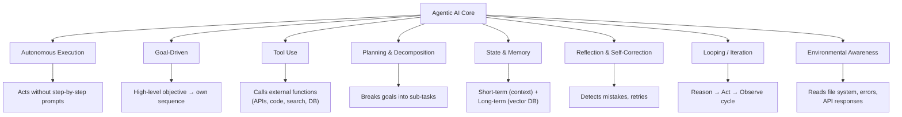

### Introduction

Agentic AI is a type of AI that works to complete a goal/task/work, without minimal human intervention.
It plans, researches, adapts, asks questions and eventually completes the goal.

### Key Characteristics

- Autonomous
- Goal Oriented
- Planning
- Reasoning
- Adaptability
- Context Awareness

